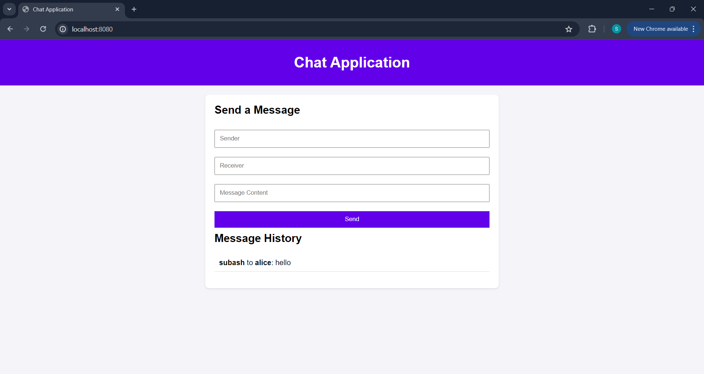
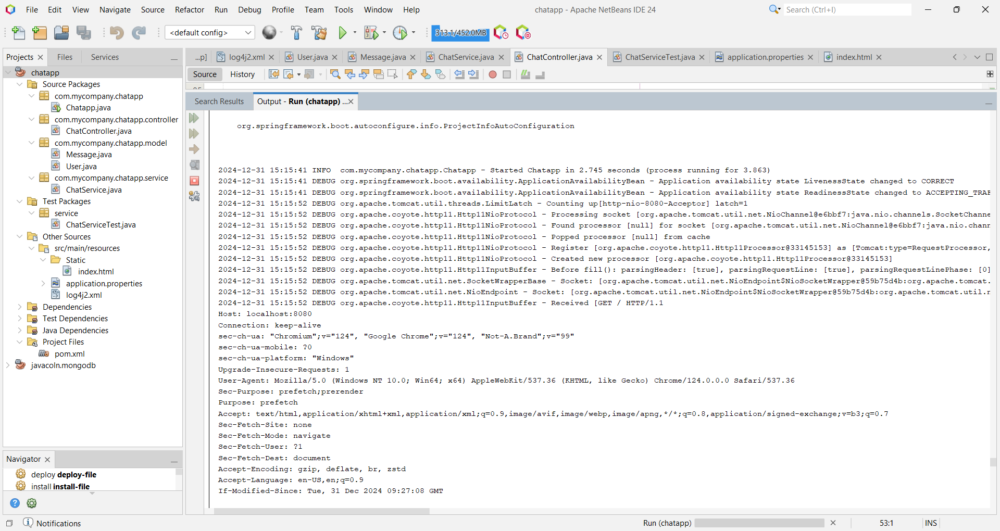
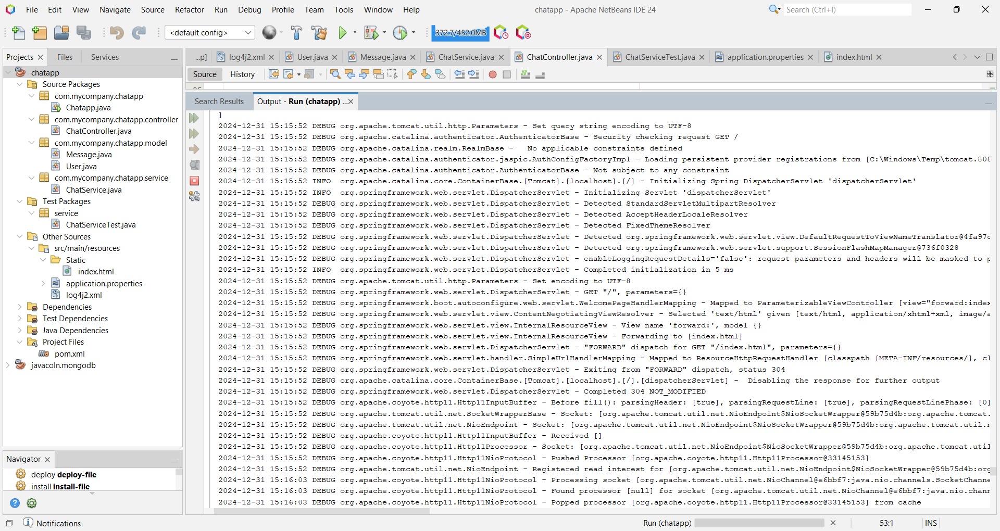
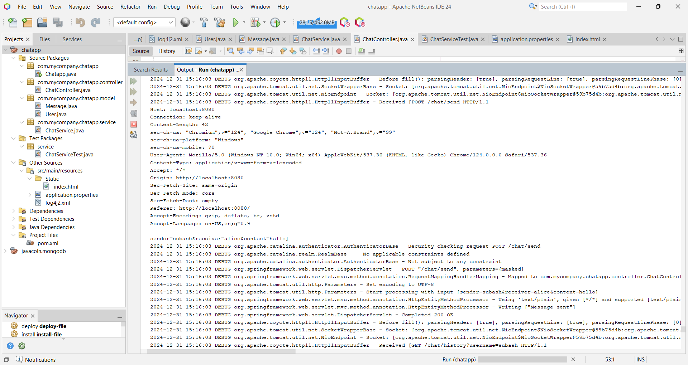
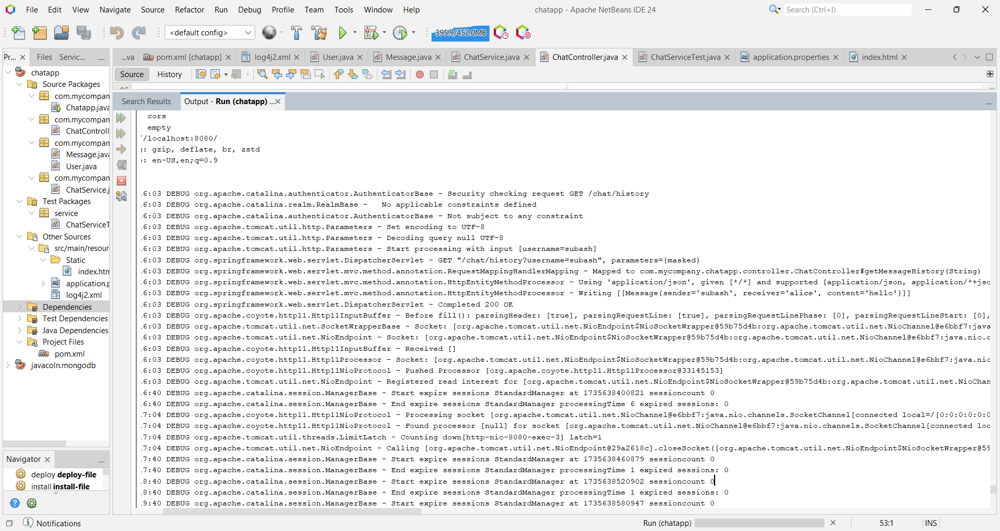

# **ChatApp using REST API with Spring Boot, Logging and Testing**
   * A simple chat application built using **Spring Boot**, **REST APIs** and **Logging** with **JUnit tests**.

# Features:
   - RESTful API for message exchange
   - Log4j integration for logging
   - Unit testing with JUnit

# Technologies used:
   - Spring Boot
   - REST API
   - Log4j
   - JUnit
   - Maven

# Screenshots:
   1. Fill Message: 
                       
                       

   2. Message output,send message and show history:
            
            
                       
                       

# Installation & Usage:
   * Clone the repository: 
     git clone 
     https://github.com/subash19197/Chatapp-JavaSpringboot
   * Build project using Maven
   * Run the application and access the REST endpoints 

# Future Enhancements:
   - WebSocket support for real-time chat
   - User authentication

# Author
   Subash.S.K

